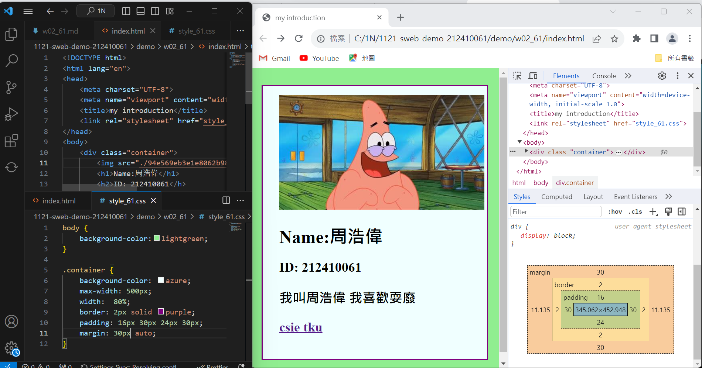
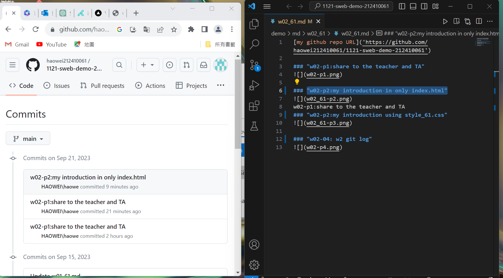

[my github repo URL]('https://github.com/haowei212410061/1121-sweb-demo-212410061')

### "w02-p1:share to the teacher and TA"

### "w02-p2:my introduction in only index.html"

w02-p1:share to the teacher and TA
### "w02-p2:my introduction using style_61.css"

### "w02-04: w2 git log"
