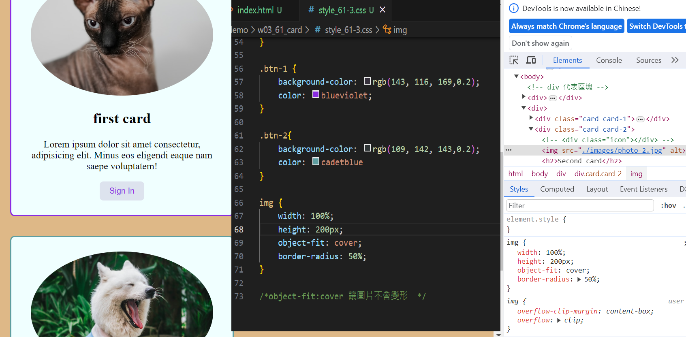

[my github repo URL]('https://github.com/haowei212410061/1121-sweb-demo-212410061')

### "w03-p1:card demo using .card and .icon for common properties"

### "w03-p2:card demo using .card-1 , .card-2 ,btn-1 ,btn-2 , for specific properties"

### "w03-p3:card demo using two photos for unsplash"

### "w03-04: w2 git log"
