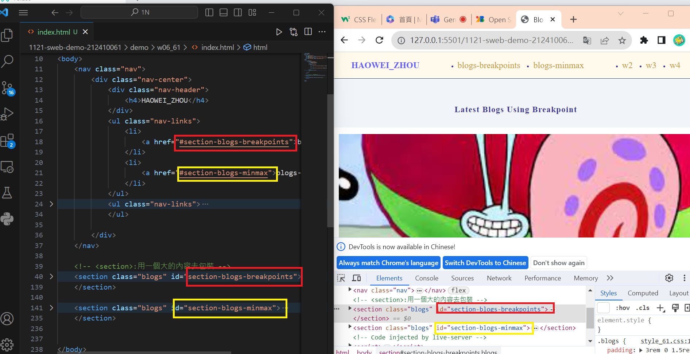
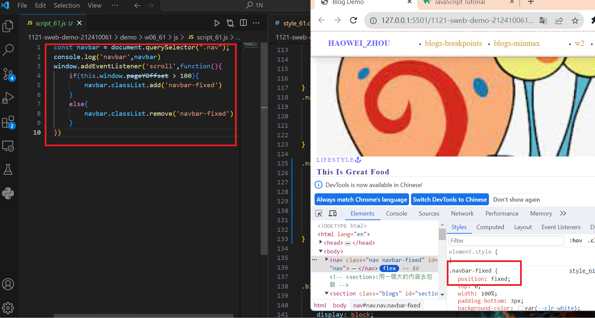
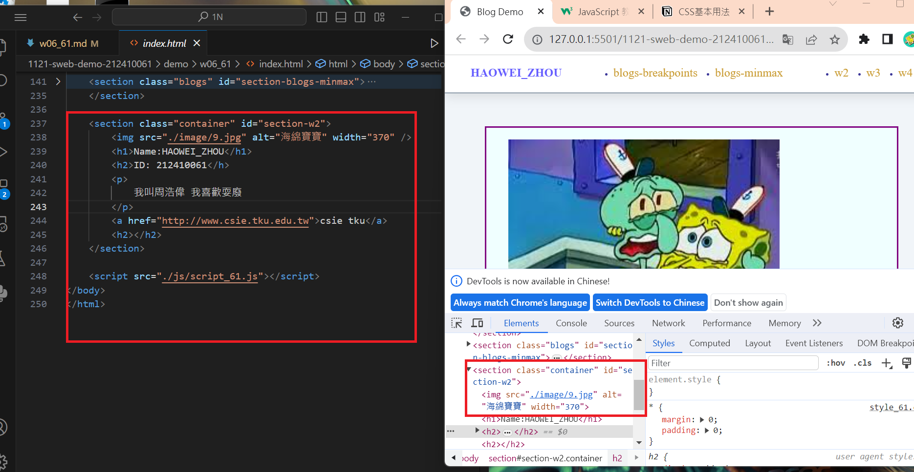
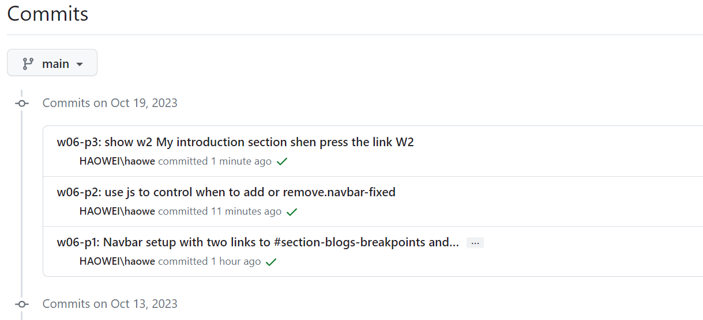

[my github repo URL('https://github.com/haowei212410061/1121-sweb-demo-212410061')]

### "w06-p1: Navbar setup with two links to #section-blogs-breakpoints and section-blogs-minmax"



```
e5fb5d5 HAOWEI\haowe    Thu Oct 19 20:10:01 2023 +0800  w06-p1: Navbar setup with two links to #section-blogs-breakpoints and section-blogs-minmax
```

### "w06-p2: use js to control when to add or remove.navbar-fixed"

35f1971 HAOWEI\haowe    Thu Oct 19 21:10:41 2023 +0800  w06-p2: use js to control when to add or remove.navbar-fixed

### "w06-p3: show W04-P2 in vercel"
[vercel url : https://1121-sweb-demo-212410061.vercel.app/]




### "w06-04: git log"


