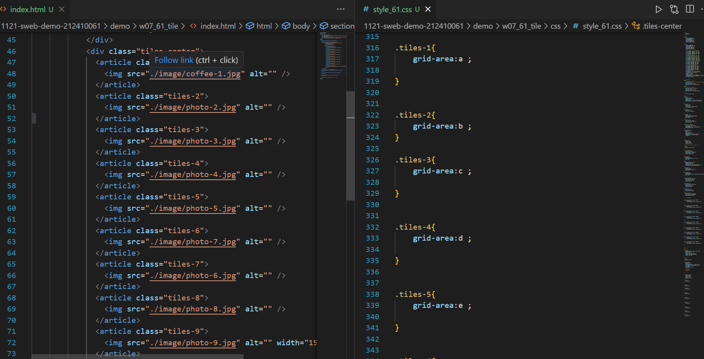

[my github repo URL]('https://github.com/haowei212410061/1121-sweb-demo-212410061')

### "w07-p1: show classdemo of week2 and week7"



```
d92c130 HAOWEI\haowe    Thu Oct 26 19:18:24 2023 +0800  w07-p1: show classdemo of week2 and week7
```
### "w07-p2: show classdemo of week7"


```
5b69fa3 HAOWEI\haowe    Thu Oct 26 19:48:04 2023 +0800  w07-p2: show classdemo of week7
```

### "w07-p3: add index.html as home page with links of class demo my github and my vercel"

```
023aee9 HAOWEI\haowe    Thu Oct 26 20:27:28 2023 +0800  w07-p3: add index.html as home page with links of class demo my github and my vercel
```


### "w07-04: git log"


