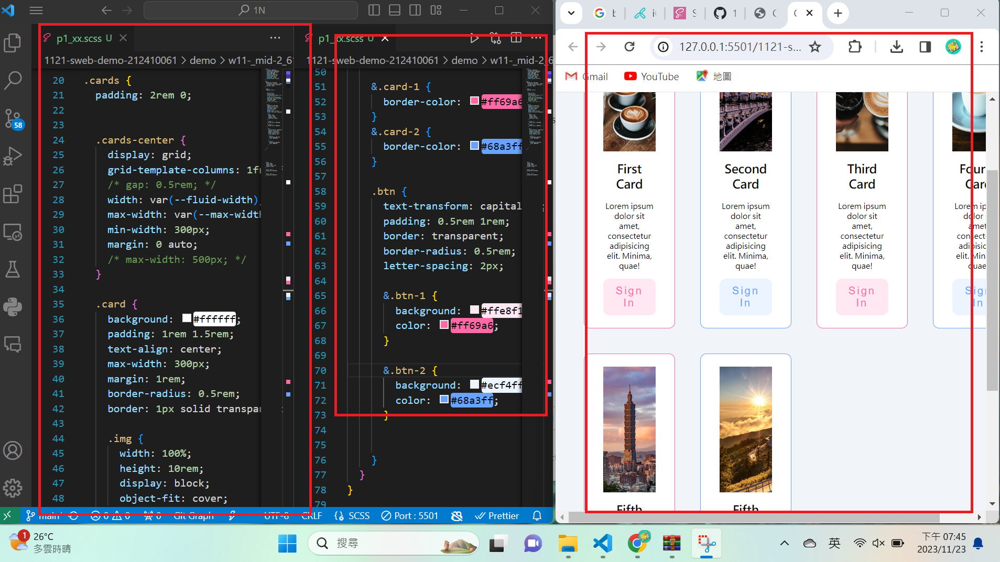
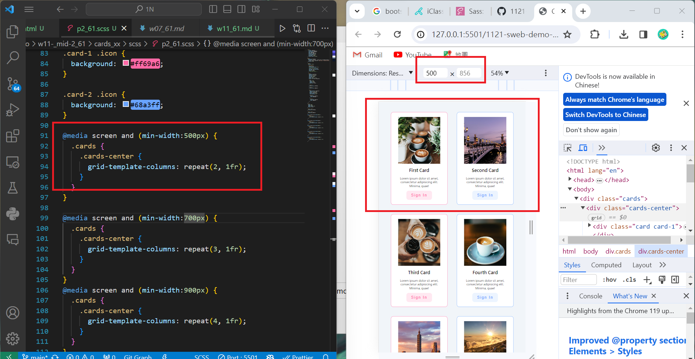
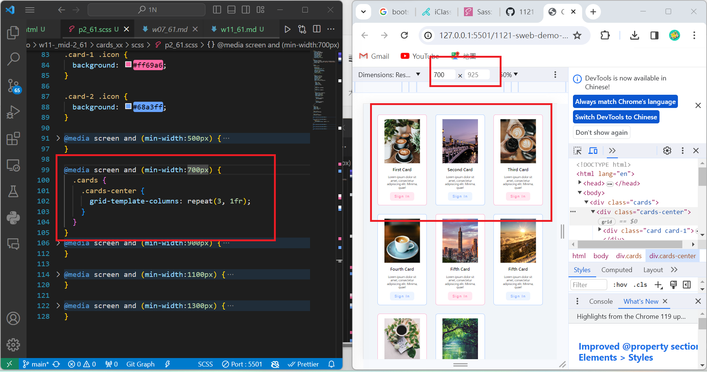
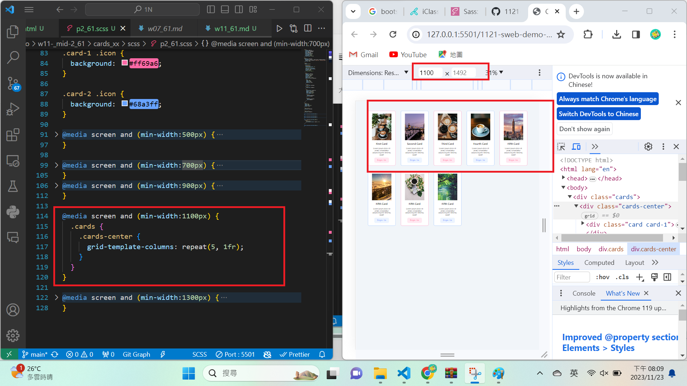
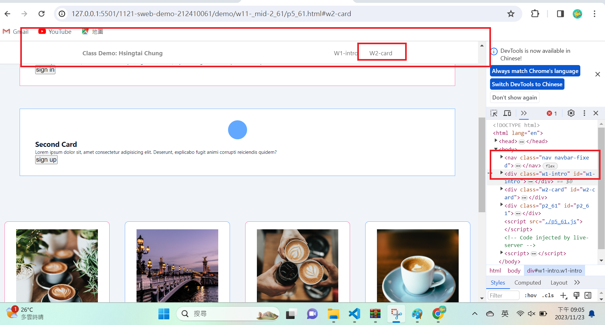
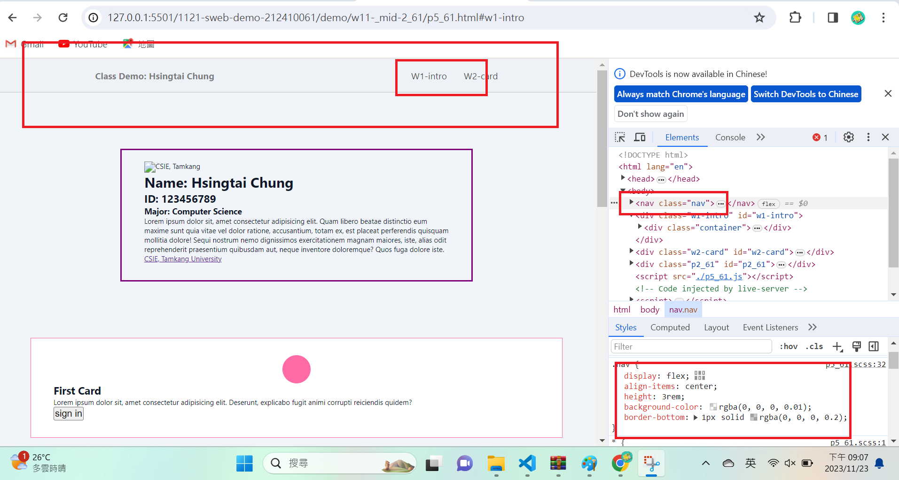

[my github repo URL]('https://github.com/haowei212410061/1121-sweb-demo-212410061')

### "w11-p1: use scss to finish p1_61"


```

```
### "w11-p2: scss to finish p2_61"






```
5b69fa3 HAOWEI\haowe    Thu Oct 26 19:48:04 2023 +0800  w11-p2: show classdemo of week7
```

### "w11-p3: add index.html as home page with links of class demo my github and my vercel"

```

```


### "w11-04: "tiles 9 picture"



