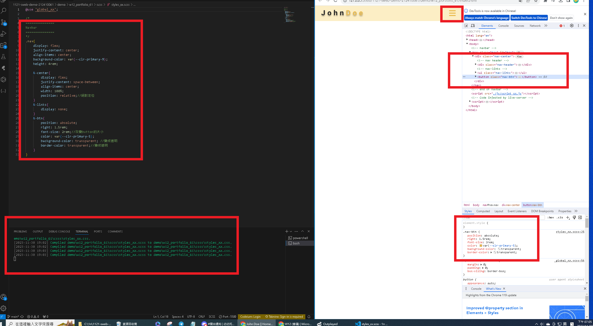
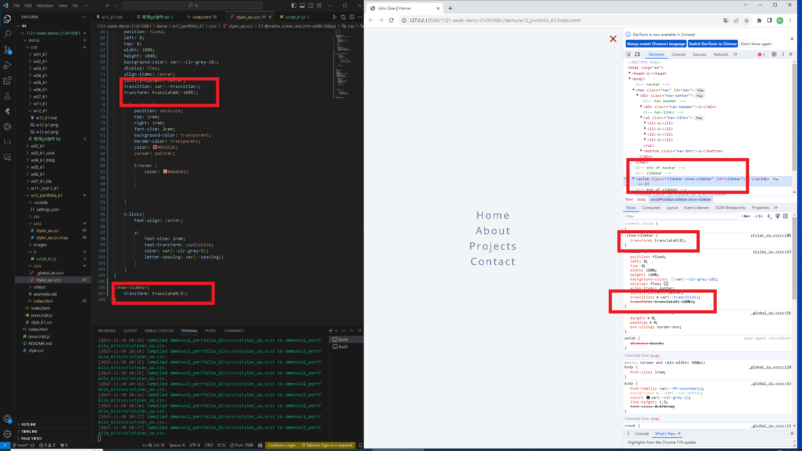
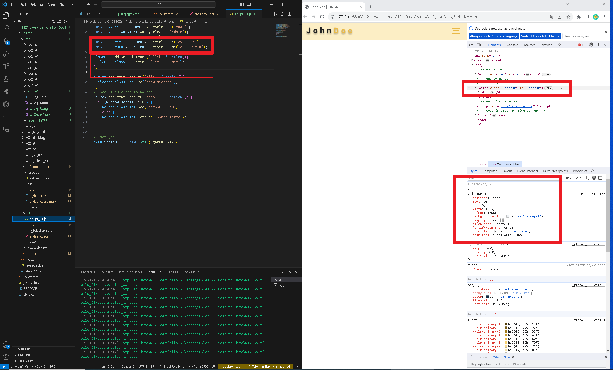
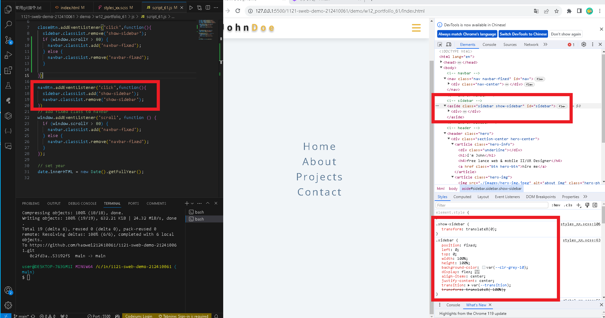

[my github repo URL]('https://github.com/haowei212410061/1121-sweb-demo-212410061')

### "w11-p1: Create manu bar with mav links missing "


```

```
### "w12-p2: scss to finish p2_61"


```
5b69fa3 HAOWEI\haowe    Thu Oct 26 19:48:04 2023 +0800  w12-p2: show classdemo of week7
```

### "w12-p3: finish p5_61 by adding cantent in p2_61"

```

```




### "w12-04: "tiles 9 picture"



