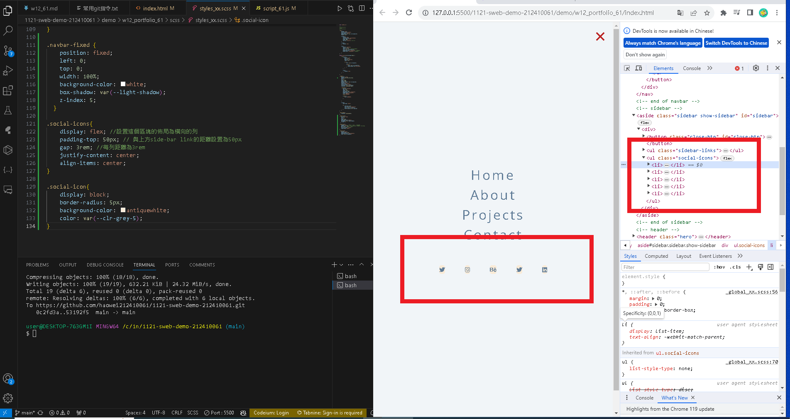

[my github repo URL]('https://github.com/haowei212410061/1121-sweb-demo-212410061')

### "w12-p1: Create manu bar with mav links missing "


```

```
### "W12-P2: Show nav-links when the screen is greater than 768px"


### "W12-P3: Create sidebar by pressing nav-btn, remove sidebar by pressing close-btn1"


### "W12-P4: Make nav-btn and close-btn works with navbar-fixed and show-sidebar"


### "W12-P5: Create five social icons in sidebar section"



### "w12-06: "git log"

