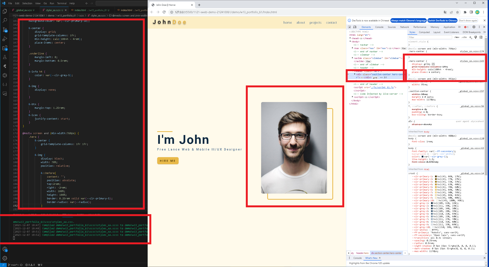
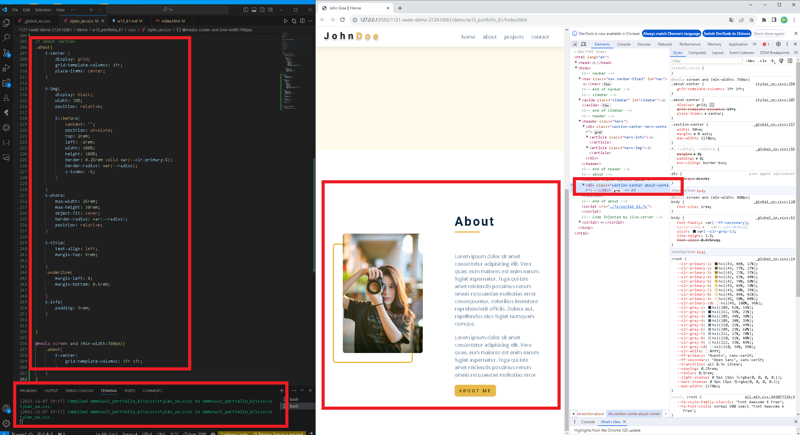
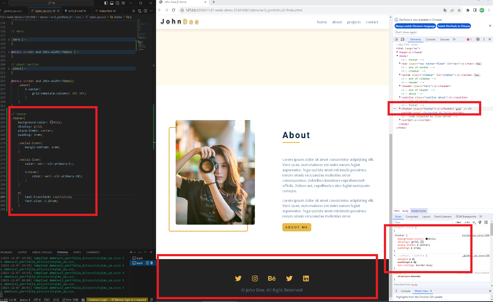
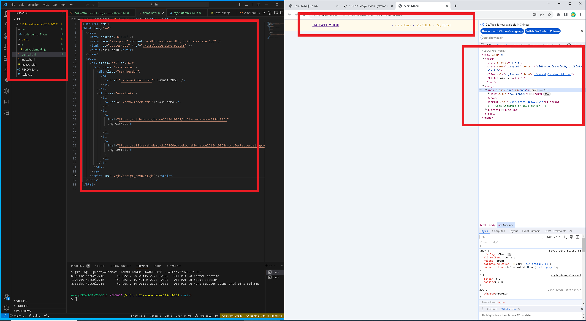
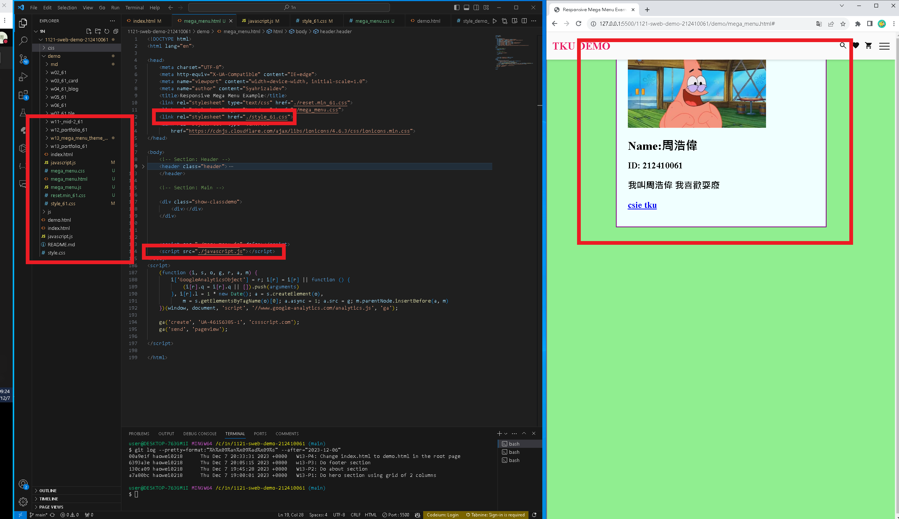

[my github repo URL]('https://github.com/haowei212410061/1121-sweb-demo-212410061')

### "W13-P1: Do hero section using grid of 2 columns"


```
a7a80bc haowei0218      Thu Dec 7 19:00:01 2023 +0800   W13-P1: Do hero section using grid of 2 columns
```
### "W13-P2: Do about section"

```
130ca09 haowei0218      Thu Dec 7 19:45:28 2023 +0800   W13-P2: Do about section
```


### "w13-P3: Do footer section"


```
6393a3e haowei0218      Thu Dec 7 20:05:15 2023 +0800   w13-P3: Do footer section
```


### "W13-P4: Change index.html to demo.html in the root page"

```
00a9e1f haowei0218      Thu Dec 7 20:33:31 2023 +0800   W13-P4: Change index.html to demo.html in the root page
```

### "W13-P5: Use mega menu theme to show w03-card page"



### "W13-P6: git log"
```
00a9e1f haowei0218      Thu Dec 7 20:33:31 2023 +0800   W13-P4: Change index.html to demo.html in the root page
6393a3e haowei0218      Thu Dec 7 20:05:15 2023 +0800   w13-P3: Do footer section
130ca09 haowei0218      Thu Dec 7 19:45:28 2023 +0800   W13-P2: Do about section
a7a80bc haowei0218      Thu Dec 7 19:00:01 2023 +0800   W13-P1: Do hero section using grid of 2 columns
```