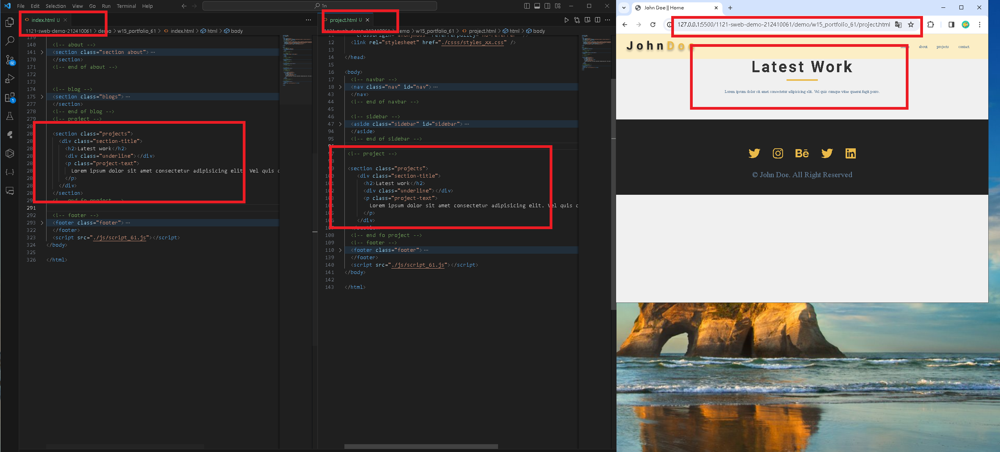
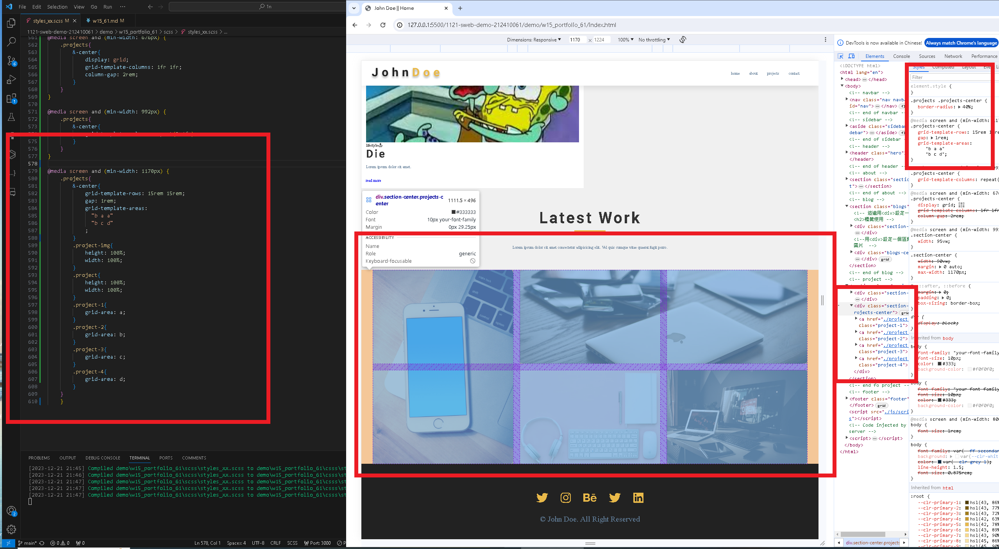

[my github repo URL]('https://github.com/haowei212410061/1121-sweb-demo-212410061')

### "W15-P1: Create projects_xx.html with header, footer same as index.html, add projects title"


```
67c4c00 haowei0218      Thu Dec 21 19:10:45 2023 +0800  W15-P1: Create projects_xx.html with header, footer same as index.html, add projects title
```
### "W15-P2: Show project-info when hovering a project"


```
0a0bc37 haowei0218      Thu Dec 21 20:11:53 2023 +0800  W15-P2: Show project-info when hovering a project
```


### "W15-P3: Responsive Design for project section"



```
6393a3e haowei0218      Thu Dec 7 20:05:15 2023 +0800   w15-P3: Do footer section
```


### "w15-P4: git log"
```
ed5e6fc haowei0218      Thu Dec 21 22:01:52 2023 +0800  W15-P3: Responsive Design for project section
94935aa haowei0218      Thu Dec 21 21:58:48 2023 +0800  W15-P3: Responsive Design for project section
0a0bc37 haowei0218      Thu Dec 21 20:11:53 2023 +0800  W15-P2: Show project-info when hovering a project
67c4c00 haowei0218      Thu Dec 21 19:10:45 2023 +0800  W15-P1: Create projects_xx.html with header, footer same as index.html, add projects title
```