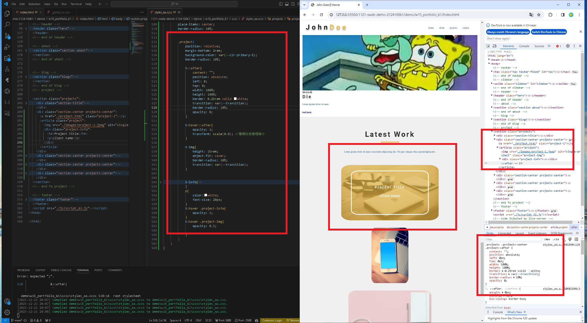

[my github repo URL]('https://github.com/haowei212410061/1121-sweb-demo-212410061')

### "W15-P1: Create projects_xx.html with header, footer same as index.html, add projects title"


```
67c4c00 haowei0218      Thu Dec 21 19:10:45 2023 +0800  W15-P1: Create projects_xx.html with header, footer same as index.html, add projects title
```
### "W15-P2: Show project-info when hovering a project"


```
0a0bc37 haowei0218      Thu Dec 21 20:11:53 2023 +0800  W15-P2: Show project-info when hovering a project
```


### "W15-P3: Responsive Design for project section"


```
6393a3e haowei0218      Thu Dec 7 20:05:15 2023 +0800   w15-P3: Do footer section
```


### "w15-P4: git log"
```
f8e5ccd haowei0218      Thu Dec 14 21:52:27 2023 +0800  w15-P3: embed w5 blog into portfolio as a section
c8d903a haowei0218      Thu Dec 14 20:52:07 2023 +0800  w15-P2: Use new version (7.1.0) of ionicons
7700e21 haowei0218      Thu Dec 14 19:34:39 2023 +0800  w15-P1: Link from homepage to class demo page and link back to homepage
```