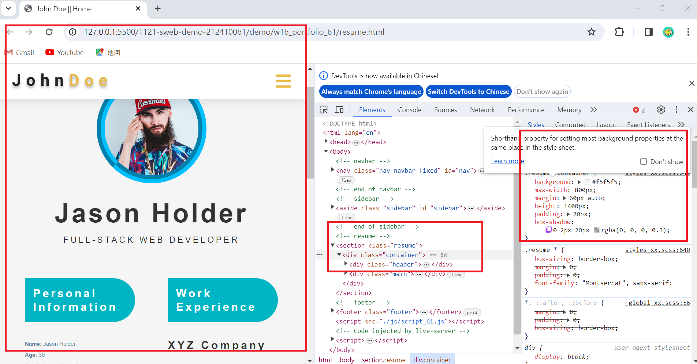

[my github repo URL]('https://github.com/haowei212410061/1121-sweb-demo-212410061')

### "w16-P1:show w3-card in demo_61.html "


### "w16-P2: Show a free resume template inside resume_61.html"


```
0a0bc37 haowei0218      Thu Dec 21 20:11:53 2023 +0800  w16-P2: Show project-info when hovering a project
```


### "w16-P3: show w7 tiles layout in demo_61.html"


```
6393a3e haowei0218      Thu Dec 7 20:05:15 2023 +0800   w16-P3: Do footer section
```


### "w16-P4: show profile in content.html"


```
115c717 HAOWEI\haowe    Thu Dec 28 21:36:23 2023 +0800  show profile in content.html
48792d1 HAOWEI\haowe    Thu Dec 28 21:30:30 2023 +0800  show w7 tiles layout in demo_61.html
ececb0b HAOWEI\haowe    Thu Dec 28 20:05:33 2023 +0800  w16-P2: Show a free resume template inside resume_61.html   
bfb002d HAOWEI\haowe    Thu Dec 28 19:38:14 2023 +0800  show w3-card in demo_61.html

```